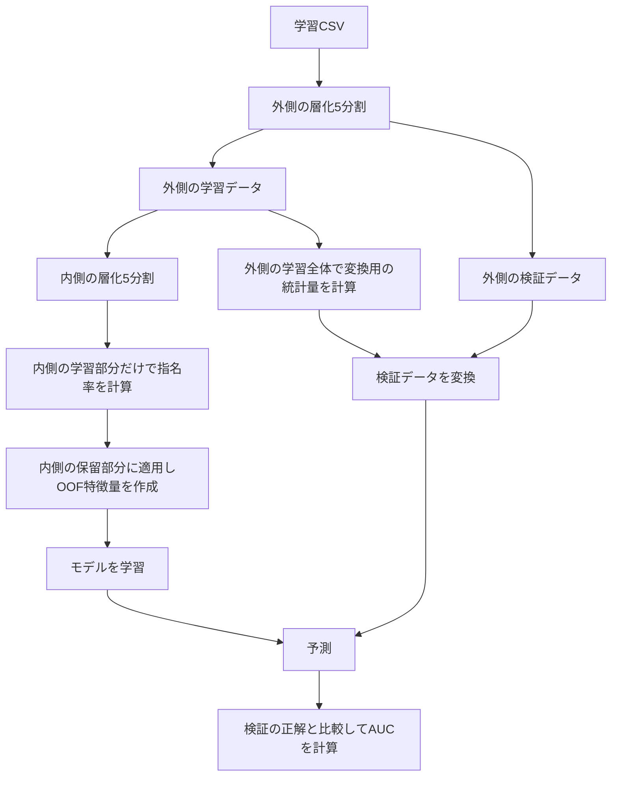
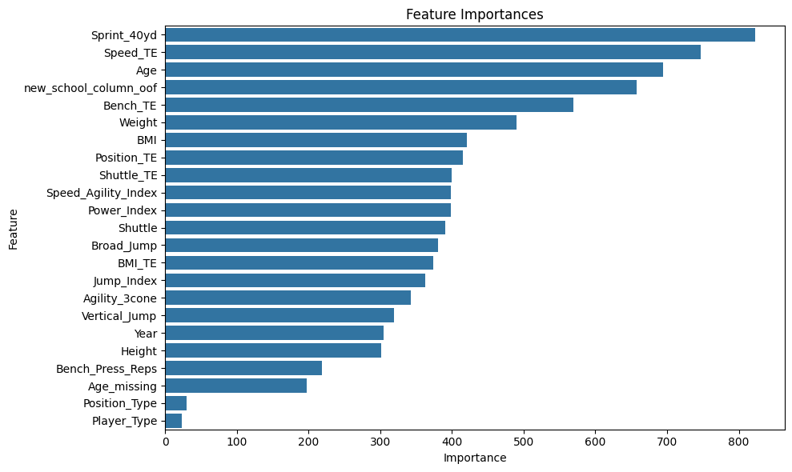

# Baseball Draft Prediction

分析用に提供された架空の野球選手データを使い、身体測定値・運動能力・所属校・ポジションからドラフト指名の有無を予測する二値分類に取り組みました。LightGBMとXGBoostを使い、特徴量の組み合わせとカテゴリ変数の扱いを比較しています。

> Draft prediction using fold-local target encoding, domain-driven feature engineering and gradient boosting.

## 評価結果

評価指標はROC AUCです。指名された選手を、指名されなかった選手より高く評価できるかを測ります。

| 実験 | 5-fold平均AUC | 評価の位置づけ |
|---|---:|---|
| LightGBM・旧実装の最終評価セル | **0.8332** | 保存済みの実行結果 |
| LightGBM・Optuna 50試行の探索時ベスト | 0.8321 | パラメータ選択に使用したCV |
| XGBoost・Optuna 50試行の探索時ベスト | 0.8326 | パラメータ選択に使用したCV |
| 特徴量追加前のLightGBM | 未計測 | 新しい評価コードで比較するベースライン |
| 分割内で前処理を行うLightGBM / XGBoost | 未計測 | 修正後の評価対象 |

LightGBMの旧最終評価は、fold順に **0.8034 / 0.8602 / 0.8574 / 0.7990 / 0.8461** でした。数値と実行ログは[元のNotebook](notebooks/archive/original_experiment.ipynb)に残しています。

旧実装では、モデルのCVより先に全学習データでOOF Target Encodingを行っていました。この順序では、検証foldの正解情報が学習側の特徴量に入るため、**0.8332をリーケージ対策後の最終性能として扱うことはできません**。また、探索と評価で同じ分割を使っており、独立したテスト評価ではありません。XGBoostの**0.8326は、Optuna 50試行で得た最高の5-fold平均CV AUC**として掲載しています。後続の評価セルには実行エラーがありますが、この探索結果は保存されています。ただし、XGBoostも同じ前処理済み特徴量を使っているため、Target Encodingの情報混入に関する制約は共通です。

ベースラインの実行記録は残っていないため、改善幅は未計測です。新しい評価コードでは、同じ分割・同じLightGBMパラメータで特徴量追加前後を比較し、AUCの差を出力します。元データを配置して再評価するまでは、改善値や修正後の最終CV AUCを掲載しません。

## データと予測対象

- 入力：`train.csv`。1行を選手のレコードとして扱います。
- 目的変数：`Drafted`。コードでは`1`を指名あり、`0`を指名なしとして扱います。
- 身体・運動能力：`Year`、`Age`、`Height`、`Weight`、`Sprint_40yd`、`Vertical_Jump`、`Bench_Press_Reps`、`Broad_Jump`、`Agility_3cone`、`Shuttle`。
- カテゴリ：`School`、`Position`、`Position_Type`、`Player_Type`。
- 識別子：`Id`。学習には使用しません。

分析対象は、課題として提供された架空の野球選手データです。実在する選手や特定リーグの実績を分析したものではありません。目的は、与えられた特徴量から指名有無を予測し、特徴量設計とモデル評価を行うことです。件数・指名率は再評価時に出力します。

課題で提供された元データはリポジトリに含めていません。再実行には同じCSVが必要です。[必要なデータの形式](data/README.md)に沿って配置してください。

## 特徴量で工夫した点

身体能力を単独で使うだけでなく、体格やポジションとの組み合わせを加えました。

| 特徴量 | 計算・意図 |
|---|---|
| `Age_missing` | 年齢の欠損自体を特徴にする |
| `Power_Index` | ベンチプレス回数 × 体重 |
| `Jump_Index` | 垂直跳び + 立ち幅跳び |
| `Speed_Agility_Index` | 40ヤード走 + シャトル + 3コーン |
| `Weight_Height_Ratio` | 体重 ÷ 身長²。単位未確認のためBMIとは区別 |
| `School_TE` / `Position_TE` | 所属校・ポジションごとの指名率を平滑化 |
| ポジションとの交互作用 | `Position_TE` × 走力・ベンチプレス・シャトル・体格比 |

各インデックスは予測用の合成値です。身体能力を直接測定する確立した指標としては扱いません。加算する測定値の単位やスケールの妥当性も、元データの定義とあわせて確認する必要があります。

旧実装の所属校スコアは`(1 + 指名率) ** 所属校のレコード数`です。指名数との積ではありません。新しい評価コードでは、件数による指数的な増大を避けるため、`(指名数 + 20 × 学習側の指名率) / (件数 + 20)`に変更しました。Positionも同じ平滑化式を使います。旧実装とは前処理とモデル設定が異なるため、旧スコアをそのまま再現するコードではありません。

## 学習・検証の分割

新しい評価では、`StratifiedKFold(n_splits=5, shuffle=True, random_state=42)`で指名割合を保ちながら分割します。外側の学習データだけでカテゴリ変換と欠損補完を学習し、Target Encodingはさらに内側の5分割で作ります。



検証側の正解は特徴量の計算に使いません。未知のSchool・Positionには学習側の指名率を使い、ほかの未知カテゴリは`-1`に変換します。数値の欠損は学習側の中央値で補完します。

比較対象は、一定確率のベースライン、元特徴量のみのLightGBM、特徴量追加後のLightGBM、特徴量追加後のXGBoostです。全モデルに同じ外側の分割を使い、fold別AUC・平均・標準偏差・OOF全体のAUC・LightGBMベースラインとの差を保存します。一定確率モデルのfold別AUCは0.5ですが、OOF全体ではfoldごとに予測確率が異なるため、0.5と一致するとは限りません。

この分割は未知の年度や学校への性能を保証するものではありません。同じ選手の複数レコードがある場合は選手単位の分割、将来年度の予測では時間順の分割が必要です。新しい比較ではパラメータを固定し、Optuna探索は行いません。探索を再導入する場合は、外側の検証データを探索に使わない構成にします。

## 特徴量重要度



元のNotebookに保存したLightGBMの重要度です。CVループ終了時の**5番目のfoldのモデルによる分岐回数**であり、5-fold平均ではありません。旧実装の評価上の制約もあるため、参考図として掲載しています。重要度は因果関係を表しません。

新しい評価コードでは、各foldのgainを合計1に正規化してから平均し、上位20特徴量を読みやすい横棒グラフとして保存します。

## 再現手順

Python 3.11以降を使用します。以下はリポジトリのルートで実行します。

```bash
git clone https://github.com/ruy00803/baseball-draft-prediction.git
cd baseball-draft-prediction
python3 -m venv .venv
source .venv/bin/activate
pip install -r requirements.txt
# 元の学習データを data/train.csv に配置
python src/evaluate.py --train data/train.csv --output results
```

macOSでLightGBMの読み込み時に`libomp`のエラーが出る場合は、`brew install libomp`でOpenMPランタイムを導入します。

[評価用Notebook](notebooks/draft_prediction.ipynb)からも実行できます。`jupyter lab`で開き、上から順に実行してください。

生成物：`metrics.json`、`oof_predictions.csv`、`feature_importance.csv`、`feature_importance.png`。元データと選手単位の予測結果はGitの追跡対象から外しています。実行時のPython・主要ライブラリのバージョンも保存します。固定seedでも、実行環境によって結果に差が出る場合があります。

```bash
python -m pytest -q
```

テストでは、合成データで未知カテゴリ・欠損値の処理、検証側の正解からの独立性、評価ファイルの生成を確認します。合成データのスコアはプロジェクトの性能として掲載しません。

## ファイル構成

```text
notebooks/draft_prediction.ipynb           評価コードの実行と結果確認
notebooks/archive/original_experiment.ipynb  元の実験・実行ログ
src/evaluate.py                           分割内前処理とベースライン比較
tests/test_evaluate.py                    評価処理のテスト
assets/legacy_feature_importance.png      保存済みの重要度図
data/README.md                            入力データの説明
requirements.txt                          固定した依存関係
```
